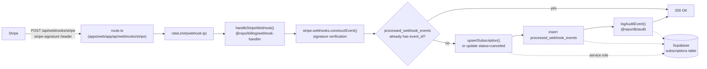
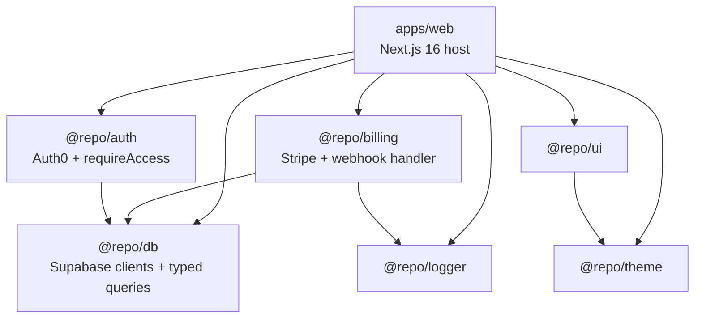

# Architecture

A single Next.js 16 deployment hosts every micro-app. The host header
(or `?app=<slug>` in dev / Vercel preview) picks an `AppConfig` from
`apps/web/lib/app-registry.ts`, which drives subdomain → route rewrite,
auth gating, and tier-based billing checks.

## Request flow (gated app)

```mermaid
flowchart TD
    Client["Browser<br/>&lt;slug&gt;.apps.lastrev.com"] --> Vercel[Vercel edge]
    Vercel --> Proxy["proxy.ts<br/>(apps/web/proxy.ts)"]

    subgraph Proxy_Pipeline ["proxy.ts middleware"]
        direction TB
        CSRF["validateCsrf()<br/>lib/csrf.ts"] --> HostLookup["getHostFromRequestHeaders()<br/>getAuth0ClientForHost()"]
        HostLookup --> RateLimit{"/auth/*?"}
        RateLimit -->|yes| AuthRL["rateLimit(auth:ip)"]
        RateLimit -->|no| AuthMW["auth0.middleware(req)<br/>session cookie refresh"]
        AuthRL --> AuthMW
        AuthMW --> SubdomainResolve["resolveSubdomain(host)<br/>getRouteForSubdomain()"]
        SubdomainResolve --> RegistryLookup["app-registry.ts<br/>getAppBySubdomain()"]
    end

    Proxy --> Proxy_Pipeline
    Proxy_Pipeline --> Decision{"known subdomain?"}
    Decision -->|no| AuthHub["redirect<br/>auth.lastrev.com"]
    Decision -->|yes| Rewrite["NextResponse.rewrite<br/>/apps/&lt;slug&gt;/..."]
    Rewrite --> Layout["apps/&lt;slug&gt;/layout.tsx"]

    Layout --> Gate["requireAppLayoutAccess(slug)<br/>lib/require-app-layout-access.ts"]
    Gate --> PublicCheck{"isPublicRoute?"}
    PublicCheck -->|yes| Page["page.tsx renders"]
    PublicCheck -->|no| RequireAccess["requireAccess(slug)<br/>@repo/auth/server"]

    RequireAccess --> PermLookup["getAppPermission(userId, slug)<br/>@repo/db/queries"]
    PermLookup --> SubLookup["getUserSubscription(userId)<br/>@repo/db/queries"]
    SubLookup --> TierCheck{"tier satisfied?"}
    TierCheck -->|no| Unauthorized["/unauthorized<br/>(accessRequest CTA)"]
    TierCheck -->|yes| Page

    Page --> Supabase[(Supabase<br/>@repo/db/server)]
```

### Key components

| Component | File | Responsibility |
|-----------|------|----------------|
| Proxy | `apps/web/proxy.ts` | Entry point. CSRF → Auth0 → subdomain rewrite. Merges Auth0 response via `mergeAuthMiddlewareResponse`. |
| Registry | `apps/web/lib/app-registry.ts` | Source of truth for `{slug, subdomain, auth, tier, ...}`. Indexed by subdomain and slug. |
| Host parsing | `apps/web/lib/proxy-utils.ts` | `resolveSubdomain()`, `getRouteForSubdomain()`, Vercel preview detection. |
| Auth factory | `packages/auth/src/auth0-factory.ts` | Per-host Auth0 client selection (multi-tenant). |
| Access gate | `apps/web/lib/require-app-layout-access.ts` | Layout-level gate. Public-route bypass, then `requireAccess()`. |
| Permission check | `packages/db/src/queries.ts` — `getAppPermission` | `app_permissions` table, `(user_id, app_slug)` unique. |
| Tier check | `packages/db/src/queries.ts` — `getUserSubscription` + `lib/tier-config.ts` | `subscriptions` table, mapped to `AppConfig.tier`. |

## Dev shortcut and preview hosts

`proxy.ts` also honors `?app=<slug>` in development or on Vercel preview
hosts (branch URLs share a single domain, so subdomain routing cannot
work). The slug is resolved through the same `getRouteForSubdomain()`
call, then removed from the URL before the rewrite.

## Stripe webhook flow



The webhook route uses the service-role Supabase client
(`@repo/db/service-role`), which is server-only. Stripe signature
verification is mandatory — an invalid signature returns 400 before any
DB work.

## Package topology



Apps in `apps/web/app/apps/<slug>/` import shared code via `@repo/*` or
local code via `@/*`. Cross-app imports (from one `apps/<slug>` into
another) are forbidden.

## Environments

| Env | Host | Supabase | Auth0 | Stripe |
|-----|------|----------|-------|--------|
| local | `localhost:3000` | dev project | dev tenant | test |
| staging | `staging.apps.lastrev.com` + previews | staging project | staging tenant | test |
| production | `apps.lastrev.com` | prod project | prod tenant | live |

Full matrix: [`docs/ops/environments.md`](ops/environments.md). Env vars
must be declared in both `.env.example` and `turbo.json` `globalEnv`.

## Further reading

- [Contributing guide](../CONTRIBUTING.md)
- [Environment matrix](ops/environments.md)
- [Migrations guide](guides/migrations.md)
- [Observability](ops/observability.md)
- [Zero-downtime deploy](ops/zero-downtime-deploy.md)
